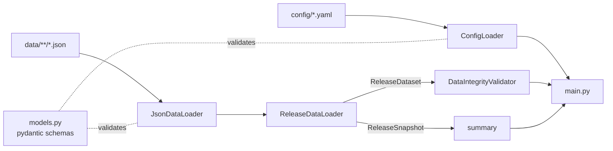
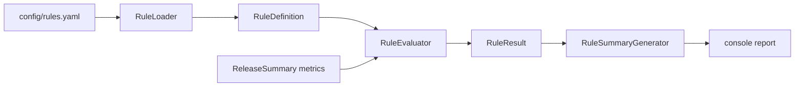

# AI Release Governance Assistant

**Phase 1: data foundation.** Loads, validates, and summarizes
release-governance data from local files, entirely offline.

## Purpose

Deciding whether a release is ready to ship means pulling together many
signals: open defects, pipeline results, regression testing, sign-offs,
change-freeze calendars, and how past releases went. This project will
eventually use AI to weigh those signals and explain a go / no-go
recommendation.

Phase 1 builds the foundation that reasoning will depend on:

- A typed, validated data model for every governance signal
- Configuration for readiness rules and scoring weights
- Fault-tolerant loading of JSON datasets and YAML configuration
- Integrity checks across datasets
- Centralized logging and a clear error hierarchy
- A factual console summary of the selected release

**No AI reasoning happens in this phase.** It makes no external calls (no
Jira, Azure DevOps, Jenkins, or ServiceNow) and uses no database.

## Example output

```
$ python main.py --quiet
=====================================

AI Release Governance Assistant

=====================================

Release Loaded : REL-2026.10 (October 2026 Platform Release, v2026.10.0)

Applications        : 5
Critical Defects    : 2
High Defects        : 4
Pipeline Status     : SUCCESS
Regression Coverage : 94%
Approvals           : 3 of 4
Freeze Active       : No
Historical Releases : 18
Data Issues         : 0

=====================================
```

How each figure is calculated:

| Line                | Calculation                                                                                     |
|---------------------|-------------------------------------------------------------------------------------------------|
| Critical / High Defects | Unresolved defects (`OPEN`, `IN_PROGRESS`, `REOPENED`). `DEFERRED` defects are not counted. |
| Pipeline Status     | The latest run (highest build number) for each application, and the worst status among them wins. |
| Regression Coverage | Average of each suite's `coverage_percent`, weighted by its number of tests.                    |
| Approvals           | Approved sign-offs out of all *required* sign-offs.                                             |
| Freeze Active       | Whether any freeze window covers the release's target date and environment.                     |
| Data Issues         | Files or records that failed to load, plus cross-dataset integrity problems.                    |

## Architecture



| Module                 | Responsibility                                                                                         |
|------------------------|--------------------------------------------------------------------------------------------------------|
| `src/models.py`        | Pydantic models and enums for every dataset and config file. All record-level validation lives here.   |
| `src/config_loader.py` | Reads `rules.yaml` and `weights.yaml` into a typed `AppConfig`. Config problems are fatal.             |
| `src/data_loader.py`   | `JsonDataLoader` reads and validates JSON files and **never raises** from its `load_*` methods: bad files and records are logged, collected as issues, and skipped. `ReleaseDataLoader` loads every dataset into a `ReleaseDataset`, from which a `ReleaseSnapshot` for one release can be taken. |
| `src/validator.py`     | Cross-dataset integrity checks: duplicate IDs, references to unknown releases or applications, implausible history dates. |
| `src/summary.py`       | Computes and formats the headline numbers. Facts only, no judgement.                                   |
| `src/logger.py`        | Central logging setup: console (stderr) plus a rotating file in `logs/`.                               |
| `src/exceptions.py`    | Application exception hierarchy.                                                                       |
| `main.py`              | Command-line entry point that wires everything together.                                               |

### Design notes

- **Two levels of validation.** Each record is validated on its own by its
  pydantic model, e.g. regression counts must add up, a resolved defect
  needs a `resolved_at` time, and timestamps must include a timezone.
  `validator.py` then checks relationships *between* records.
- **Fail soft on data, fail fast on config.** A broken data file shouldn't
  hide the rest of the data, so the loader keeps going and reports issues.
  Broken configuration makes any later analysis meaningless, so the program
  stops with a clear message (exit code 2).
- **Open for extension.**
  - A new dataset needs only a model, a `DatasetSpec` entry, and a field on
    `ReleaseDataset`.
  - A new integrity check is a function passed to `DataIntegrityValidator`.
- **Dependency injection.** `ReleaseDataLoader` accepts its `JsonDataLoader`,
  and the validator accepts its checks, so either can be swapped out in tests
  or in future phases.
- **Immutable records.** Data models are frozen once loaded. Unknown JSON
  fields are ignored, so richer exports from source systems still load, but
  unknown keys in configuration are rejected so typos are caught.

## Phase 2: Rule Engine architecture

Phase 2 adds a deterministic governance rule engine. It does not attempt AI
reasoning; it evaluates only explicit business rules stored in configuration.



The Phase 2 components are:

| Module | Responsibility |
|--------|----------------|
| `src/rule_models.py` | Typed rule definitions and decision enums. |
| `src/rule_result.py` | Per-rule result objects and the human-readable console report. |
| `src/rule_engine.py` | Loads rules from YAML, evaluates them against metrics, and returns a final governance decision. |

### How rules work

A rule is defined by a metric name, a comparison operator, and a threshold. The
rule engine reads a metrics dictionary such as the release summary values and
evaluates each rule. Example:

```yaml
governance:
  rules:
    - name: Critical Defects
      field: open_critical_defects
      operator: gt
      value: 0
      outcome: BLOCK
      recommendation: Close critical defects
```

The engine matches the configured field against the configured comparison, then
returns a `PASS`, `FAIL`, or `WARNING` status. The overall recommendation is one
of `PROCEED`, `CONDITIONAL APPROVAL`, `BLOCK`, or `ESCALATE`.

### Adding new governance rules

To extend the governance policy:

1. Add a new item to `config/rules.yaml` under `governance.rules`.
2. Give it a unique `name` and the `field` that the release summary exposes.
3. Choose a comparison such as `gt`, `lt`, `gte`, `lte`, `eq`, or `ne`.
4. Set `outcome` to one of `BLOCK`, `ESCALATE`, or `CONDITIONAL APPROVAL`.
5. Add a clear `recommendation` explaining the remediation.

The engine reads the YAML at runtime, so thresholds stay configurable and are
never hardcoded in Python.

### Exceptions

| Exception               | Raised when                                          |
|-------------------------|------------------------------------------------------|
| `ReleaseGovernanceError`| Base class for all of the below                      |
| `ConfigurationError`    | Configuration is malformed or fails validation       |
| `MissingFileError`      | A required file or directory doesn't exist           |
| `InvalidJsonError`      | A data file isn't valid JSON                         |
| `DataValidationError`   | A record doesn't match its schema                    |
| `ReleaseNotFoundError`  | The requested release isn't in the data              |

## Folder structure

```
release-governance-ai/
├── README.md
├── requirements.txt
├── pyproject.toml          # project metadata and pytest settings
├── main.py                 # command-line entry point
├── config/
│   ├── rules.yaml          # readiness thresholds
│   └── weights.yaml        # scoring weights and decision thresholds
├── data/
│   ├── releases/           # one file per release, with its applications
│   ├── defects/
│   ├── pipelines/
│   ├── testing/            # regression test results
│   ├── approvals/
│   ├── freeze/             # production freeze calendar
│   └── history/            # outcomes of past releases
├── src/
│   ├── models.py
│   ├── config_loader.py
│   ├── data_loader.py
│   ├── validator.py
│   ├── summary.py
│   ├── logger.py
│   └── exceptions.py
├── tests/
└── logs/                   # created at runtime; ignored by git
```

Every `*.json` file in a data folder is loaded. A file may hold a single
object or an array of objects. Timestamps are ISO 8601 with a timezone,
e.g. `2026-10-20T02:00:00Z`.

### Sample data

The sample data describes a realistic quarterly release, **REL-2026.10**,
covering five applications (Customer Portal, Payments, Identity & Access,
Notifications, Reporting). It includes:

- 16 defects across every severity and status, including deferred and
  reopened ones
- Pipeline runs, including a failed build that was later fixed
- 6 regression suites
- 4 approvals, one still pending with the Change Advisory Board
- A freeze calendar with a quarter-end close, a maintenance window, and
  the holiday freeze
- 18 historical releases with a mix of clean releases, hotfixes, and
  rollbacks

A second release, **REL-2026.11**, is in planning.

## Installation

Requires **Python 3.12 or newer**.

```bash
cd release-governance-ai
python3 -m venv venv
source venv/bin/activate        # Windows: venv\Scripts\activate
pip install -r requirements.txt
```

## Running

```bash
python main.py                          # summarize the next active release
python main.py --release-id REL-2026.11 # summarize a specific release
python main.py --quiet                  # only warnings and errors on the console
python main.py --help                   # all options
```

| Option         | Default    | Purpose                                     |
|----------------|------------|---------------------------------------------|
| `--release-id` | next active release | Release to summarize               |
| `--config-dir` | `config/`  | Folder with `rules.yaml` and `weights.yaml` |
| `--data-dir`   | `data/`    | Folder with the JSON datasets               |
| `--log-dir`    | `logs/`    | Folder for `release_governance.log`         |
| `-q, --quiet`  | off        | Hide INFO messages on the console           |

The summary goes to stdout and log messages go to stderr, so
`python main.py > summary.txt` captures only the report.

Exit codes:

| Code | Meaning                                    |
|------|--------------------------------------------|
| `0`  | Success (data issues are reported, not fatal) |
| `1`  | Requested release not found                |
| `2`  | Configuration missing or invalid           |

### Logging

Log lines look like this:

```
2026-10-02 15:13:15 | INFO     | src.data_loader | Loaded defects: 16 record(s) from 1 file(s)
2026-10-02 15:13:15 | ERROR    | src.data_loader | defects.json[3]: severity: Input should be 'CRITICAL', 'HIGH', 'MEDIUM' or 'LOW'
```

They're written to the console and to `logs/release_governance.log`. The
file rotates at 5 MB and keeps 5 backups.

## Running the tests

```bash
python -m pytest            # all tests
python -m pytest -v         # one line per test
python -m pytest tests/test_data_loader.py
```

The tests cover:

| File                    | Covers                                                                 |
|-------------------------|------------------------------------------------------------------------|
| `test_config_loader.py` | Loading config, missing files, invalid YAML, unknown keys, bad types and enums, weights that don't sum to 1 |
| `test_data_loader.py`   | Loading JSON, missing files and folders, invalid JSON, invalid schema, partial failures, release selection |
| `test_models.py`        | Validation rules, defaults, and enums for every model                  |
| `test_validator.py`     | Duplicate IDs, broken references, pluggable checks                     |
| `test_summary.py`       | Headline calculations and report formatting                            |
| `test_main.py`          | End-to-end runs, exit codes, log file format, quiet mode               |

Tests write only to temporary folders, never to `data/`, `config/`, or `logs/`.

## Roadmap

| Phase | Focus |
|-------|-------|
| **1. Foundation** *(this phase)* | Models, configuration, loading, validation, logging, summary |
| **2. Rule engine** | Evaluate each release against `rules.yaml` and compute a weighted readiness score from `weights.yaml`, with deterministic and fully explainable results |
| **3. AI reasoning** | Use an LLM to interpret the evidence: summarize risk, explain trade-offs in plain language, spot patterns in historical releases, and draft a go / no-go recommendation with cited evidence |
| **4. Reporting** | HTML/PDF readiness reports, comparison between releases, trend dashboards |
| **5. Integrations** | Optional connectors (Jira, Azure DevOps, Jenkins, ServiceNow) that write the same JSON schema, so the core stays offline-capable |
| **6. Workflow** | Approval workflow, audit trail, notifications, and an API for CI/CD gates |
